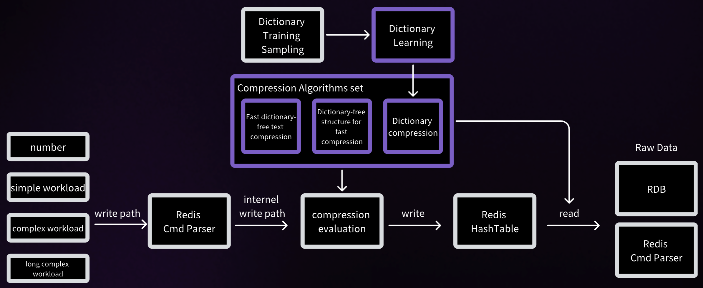

Other languages: [简体中文](README.zh-CN.md)

[Website](https://www.montplex.com/) • [Engula trial instructions](engula-test-intro.md)
## The Most Cost-Efficient In-Memory Data Store
Engula is a high-performance, enhanced distribution of Redis®* OSS, designed to deliver superior memory compression and performance optimizations without altering Redis's protocol or binary outputs. Engula ensures full compatibility with Redis APIs, enabling seamless adoption without any code changes.

## Features

- **Redis Compatibility**: Fully compatible with Redis protocols and APIs across versions 5.0.14, 6.2.16, and 7.2.4.
- **Memory Compression**: Advanced hybrid compression algorithms that automatically select compression based on workload, optimizing memory usage without compromising performance.
- **Consistent Behavior**: Maintains Redis’s transaction model, correctness, and behavior across all supported versions.
- **Full compatibility**: Engula maintains the same transaction model, correctness, and behavior as the corresponding Redis versions.
- **Binary compatibility**: Data files generated by Engula are fully compatible with Redis OSS.

## Contents

- [Compression Algorithm](#compression-algorithm)
- [Compression Efficiency](#compression-efficiency)
- [Configuration](#configuration)
- [Licensing](#licensing)

## Compression Algorithm
Engula's advanced compression algorithm intelligently evaluates data to determine the optimal compression strategy. It balances the trade-off between compression overhead and memory savings, delivering efficient performance for varied workloads.

### Compression Efficiency

| Industry        | Scenario            | Before Compression | After Compression | Space Savings | Average Value Size |
|-----------------|---------------------|---------------------|-------------------|---------------|---------------------|
| Gaming Forum    | Feature Store       | 13.88 GB | 6.11 GB | 56% | 4 KB |
| Restaurant SaaS | Favorites and Carts | 2.11 GB | 0.91 GB | 57% | 2 KB |
| Car Rental      | Traffic Operations  | 3.1 GB | 1.7 GB | 45% | - |
| Banking         | Risk Control Model  | 9.44 GB | 2.352 GB | 75% | 5 KB |
## Configuration

Engula supports common Redis configuration parameters to ensure seamless integration.
## Licensing
For detailed license information, please see the [LICENSES](LICENSES) file.

> Redis is a registered trademark of Redis Ltd. Any rights therein are reserved to Redis Ltd. Any use by Montplex is for referential purposes only and does not indicate any sponsorship, endorsement or affiliation between Redis and Montplex.