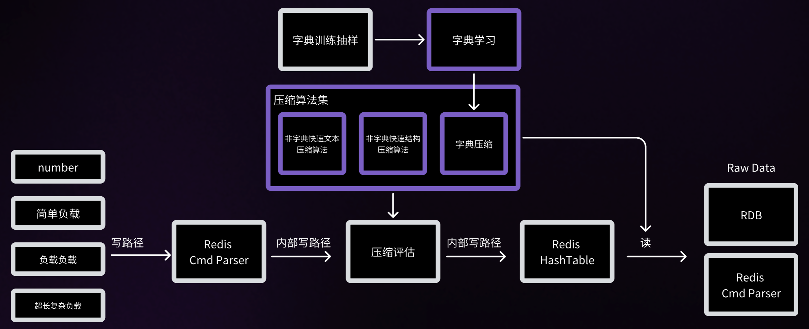

其他语言：[简体中文](README.zh-CN.md)

[官方网站](https://www.montplex.com/) • [Engula 测试版使用说明](engula-test-intro-cn.md)

## 最具成本效益的内存数据存储

Engula 是由 Montplex 开发的 Redis®* OSS 高性能增强版，旨在提供卓越的内存压缩和性能优化，同时不改变 Redis 的协议或二进制输出。Engula 确保与 Redis API 完全兼容，无需任何代码更改即可无缝采用。

## 特性

- **Redis 兼容性**：完全兼容 Redis 5.0.14、6.2.16 和 7.2.4 版本的协议和 API。
- **内存压缩**：先进的混合压缩算法，根据工作负载自动选择压缩方式，优化内存使用而不影响性能。
- **一致行为**：在所有支持的版本中保持 Redis 的事务模型、正确性和行为。
- **完全兼容性**：Engula 保持与相应 Redis 版本相同的事务模型、正确性和行为。
- **二进制兼容性**：Engula 生成的数据文件与 Redis OSS 完全兼容。

## 目录

- [压缩算法](#压缩算法)
- [压缩效率](#压缩效率)
- [配置](#配置)
- [许可证](#许可证)

## 压缩算法

Engula 的先进压缩算法智能评估数据以确定最佳压缩策略。它平衡了压缩开销和内存节省之间的权衡，为各种工作负载提供高效性能。

### 压缩效率

| **业务名称**       | **压缩前** | **压缩后** | **压缩率** | **平均值大小** |
|----------------|------------|------------|------------|----------------|
| 互联网论坛用户资料      | 13.88 GB               | 6.11 GB               | 44%                  | 4 KB                   |
| 外卖 App 收藏夹和购物车 | 2.11 GB                | 0.91 GB               | 42%                  | 2 KB                   |
| 租车平台交通运营记录     | 3.1 GB                 | 1.7 GB                | 55%                  | -                      |
| 银行风控平台数据       | 9.44 GB                | 2.352 GB              | 25%                  | 5 KB                   |

## 配置

Engula 支持常见的 Redis 配置参数，以确保无缝集成。

## 许可证

有关详细的许可证信息，请查看 [LICENSES](LICENSES) 文件。

> Redis 是 Redis Ltd. 的注册商标。其中的任何权利均保留给 Redis Ltd。Montplex 对其的任何使用仅出于引用目的，并不表示 Redis 和 Montplex 之间存在任何赞助、认可或附属关系。