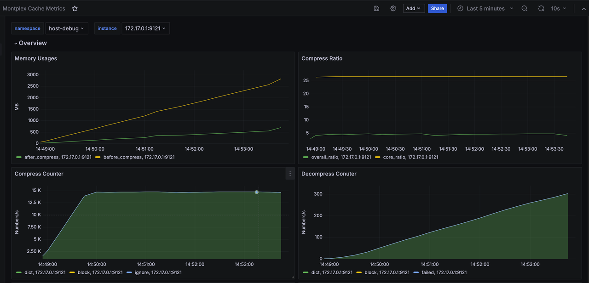

# 1. 概述

Engula 是一个 100% 兼容 Redis 的自研缓存内核产品，包含以下几个组件：

- engula-server(必选)：一个内置压缩算法、与 redis-server 全兼容的可执行程序。
- engula-exporter(可选)：开源 redis-exporter 的扩展版，支持输出 engula-server 特有的监控 metrics。
- Engula Dashboard (可选)：Grafana Dashboard 的定义文件，可以导入 Grafana 系统，展示 engula-exporter 输出的 engula-server 监控 metrics。

注：该版本为测试版，默认有效期为1个月。

# 2. 在现有的 Redis 系统中部署 Engula

## 2.1 安装

把 engula.tar.gz 文件解压，在 engula/bin 目录下包含 engula-server 和 engula-exporter 可执行文件，以及对应的 redis 软连接。

```bash
$ tar -xvf engula-v1.0.0-r5.0.14.linux-amd64.tar.gz 

$ ls -l engula-v1.0.0-r5.0.14/bin/
total 44236
-rwxr-xr-x 1 ubuntu ubuntu 9266080 Oct  9 12:26 engula-server
-rwxr-xr-x 1 ubuntu ubuntu 8302744 Oct  9 12:30 engula_exporter
-rwxr-xr-x 1 ubuntu ubuntu 4367928 Oct  9 12:26 redis-benchmark
-rwxr-xr-x 1 ubuntu ubuntu 9266080 Oct  9 12:26 redis-check-aof
-rwxr-xr-x 1 ubuntu ubuntu 9266080 Oct  9 12:26 redis-check-rdb
-rwxr-xr-x 1 ubuntu ubuntu 4809456 Oct  9 12:26 redis-cli
lrwxrwxrwx 1 ubuntu ubuntu      13 Oct  9 12:26 redis-sentinel -> engula-server
lrwxrwxrwx 1 ubuntu ubuntu      13 Oct  9 12:26 redis-server -> engula-server
lrwxrwxrwx 1 ubuntu ubuntu      15 Oct  9 12:30 redis_exporter -> engula_exporter

$ ls -l engula-v1.0.0-r5.0.14/conf/
total 112
-rw-r--r-- 1 ubuntu ubuntu 46942 Oct  9 12:29 engula-dashboard.json
-rw-r--r-- 1 ubuntu ubuntu 63088 Oct  9 12:29 redis.conf
```
## 2.2 部署
因为 engula-server 与 redis-server 100% 兼容，在现有的 Redis 系统中替换 engula-server 非常简单，只需要用 engula-server 程序替代 redis-server 程序即可。

## 2.3 监控
### 2.3.1 通过 "ENGULA INFO" 命令
engula-server 运行过程中，可以用 redis-cli 执行 `engula info` 命令，获取 engula-server 的运行时信息：

注：使用 redis 原生的 redis-cli 程序，不会对 `engula info` 命令输出内容进行换行格式化。使用 engula 安装包中自带的 redis-cli 程序可以获得更易于阅读的输出结果。
```bash
./redis-cli engula info

# Summary
compress_enabled:1
license_remaining:2569632
memory_raw_data_bytes:0
memory_compressed_data_bytes:0
memory_tot_saved_bytes:0
compress_tot_ignore_cnt:0

# Block
block_compress_tot_cnt:0
block_compress_failed_cnt:0
block_compress_tot_before_bytes:0
block_compress_tot_after_bytes:0
block_decompress_tot_cnt:0
block_decompress_failed_cnt:0

# Dict
dict_compress_tot_cnt:0
dict_compress_failed_cnt:0
dict_compress_tot_before_bytes:0
dict_compress_tot_after_bytes:0
dict_decompress_tot_cnt:0
dict_decompress_failed_cnt:0
```

### 2.3.2 通过 Prometheus/Grafana
如果现有的 Redis 系统中有 redis-exporter / prometheus 监控体系，且希望监控 engula server 特有的运行指标，可以执行下面的可选步骤：

* 使用 engula-exporter 程序替代 redis-exporter 程序。
* 在 Grafana 的操作界面，选择 `Dashboards -> New -> Import`, 导入安装包内包含的 Dashboad 文件 `conf/engula-dashboard.json`

展示页面样例：

