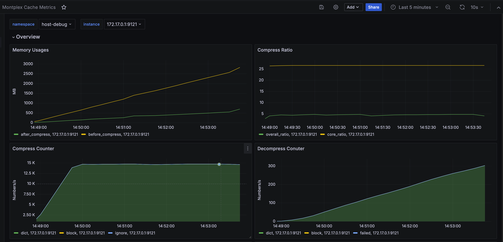

# 1. Overview

Engula is a 100% Redis-compatible, self-developed cache kernel product that includes the following components:

- engula-server (required): An executable program with built-in compression algorithms, fully compatible with redis-server.
- engula-exporter (optional): An extended version of the open-source redis-exporter, supporting output of engula-server-specific monitoring metrics.
- Engula Dashboard (optional): A Grafana Dashboard definition file that can be imported into the Grafana system to display engula-server monitoring metrics output by engula-exporter.

Note: This is a trial version for users with a default validity period of 1 month.

# 2. Deploying Engula in Existing Redis Systems

## 2.1 Installation

Extract the engula.tar.gz file. The engula/bin directory contains engula-server and engula-exporter executables, as well as corresponding redis symbolic links.

```bash
$ tar -xvf engula-v1.0.0-r5.0.14.linux-amd64.tar.gz 

$ ls -l engula-v1.0.0-r5.0.14/bin/
total 44236
-rwxr-xr-x 1 ubuntu ubuntu 9266080 Oct  9 12:26 engula-server
-rwxr-xr-x 1 ubuntu ubuntu 8302744 Oct  9 12:30 engula_exporter
-rwxr-xr-x 1 ubuntu ubuntu 4367928 Oct  9 12:26 redis-benchmark
-rwxr-xr-x 1 ubuntu ubuntu 9266080 Oct  9 12:26 redis-check-aof
-rwxr-xr-x 1 ubuntu ubuntu 9266080 Oct  9 12:26 redis-check-rdb
-rwxr-xr-x 1 ubuntu ubuntu 4809456 Oct  9 12:26 redis-cli
lrwxrwxrwx 1 ubuntu ubuntu      13 Oct  9 12:26 redis-sentinel -> engula-server
lrwxrwxrwx 1 ubuntu ubuntu      13 Oct  9 12:26 redis-server -> engula-server
lrwxrwxrwx 1 ubuntu ubuntu      15 Oct  9 12:30 redis_exporter -> engula_exporter

$ ls -l engula-v1.0.0-r5.0.14/conf/
total 112
-rw-r--r-- 1 ubuntu ubuntu 46942 Oct  9 12:29 engula-dashboard.json
-rw-r--r-- 1 ubuntu ubuntu 63088 Oct  9 12:29 redis.conf
```

## 2.2 Deployment

Since engula-server is 100% compatible with redis-server, replacing engula-server in existing Redis systems is very simple. You only need to replace the redis-server program with the engula-server program.

## 2.3 Monitoring

### 2.3.1 Using the `ENGULA INFO` Command

While engula-server is running, you can use redis-cli to execute the `engula info` command to obtain runtime information of engula-server:

Note: Using the native redis-cli program will not format the output of the `engula info` command with line breaks. Using the redis-cli program included in the engula installation package will provide more readable output results.

```bash
./redis-cli engula info

# Summary
compress_enabled:1
license_remaining:2569632
memory_raw_data_bytes:0
memory_compressed_data_bytes:0
memory_tot_saved_bytes:0
compress_tot_ignore_cnt:0

# Block
block_compress_tot_cnt:0
block_compress_failed_cnt:0
block_compress_tot_before_bytes:0
block_compress_tot_after_bytes:0
block_decompress_tot_cnt:0
block_decompress_failed_cnt:0

# Dict
dict_compress_tot_cnt:0
dict_compress_failed_cnt:0
dict_compress_tot_before_bytes:0
dict_compress_tot_after_bytes:0
dict_decompress_tot_cnt:0
dict_decompress_failed_cnt:0
```

### 2.3.2 Using Prometheus/Grafana

If the existing Redis system has a redis-exporter / prometheus monitoring system and you want to monitor engula server-specific runtime metrics, you can perform the following optional steps:

* Replace the redis-exporter program with the engula-exporter program.
* In the Grafana interface, select `Dashboards -> New -> Import` and import the Dashboard file `conf/engula-dashboard.json` included in the installation package.

Sample display page:


